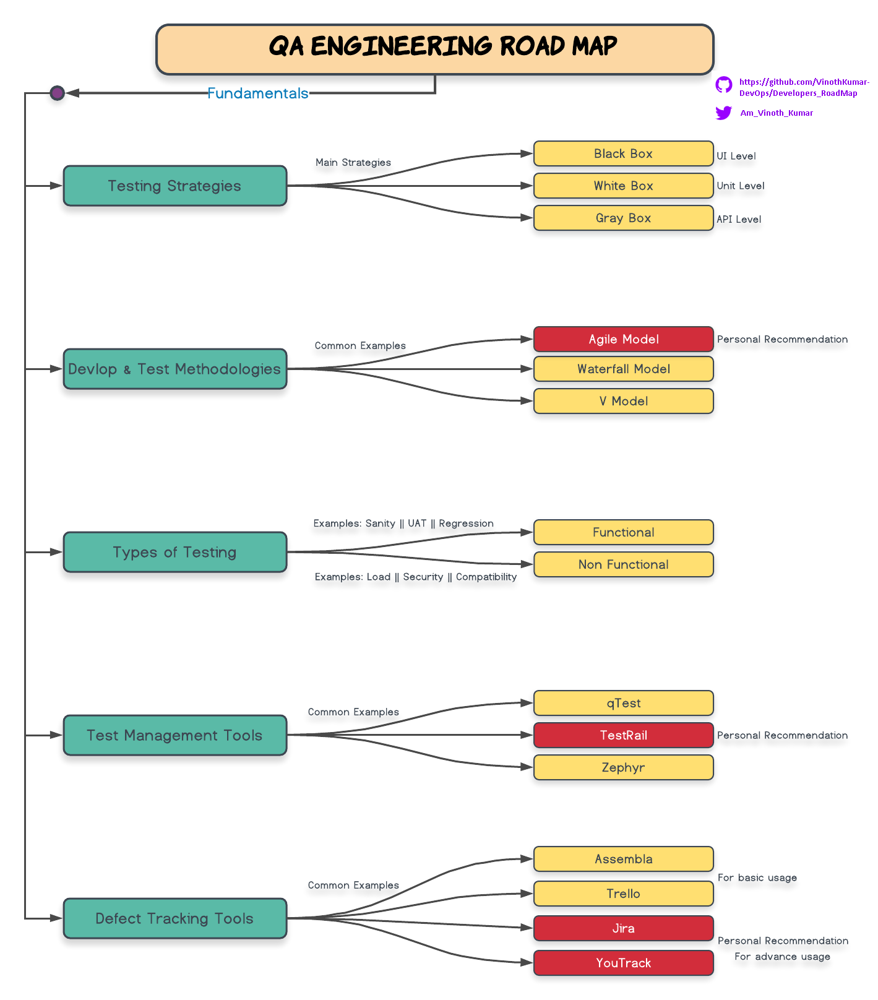
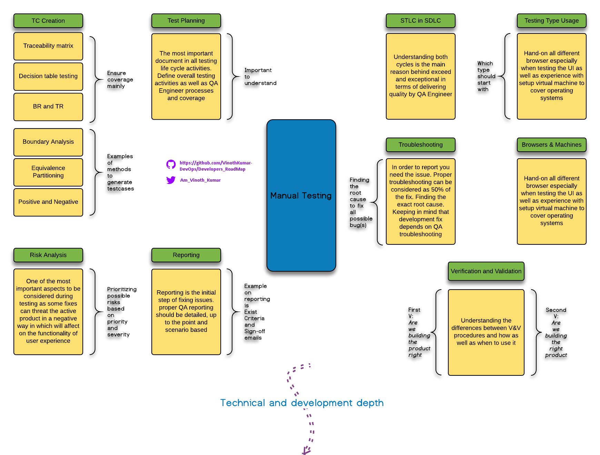
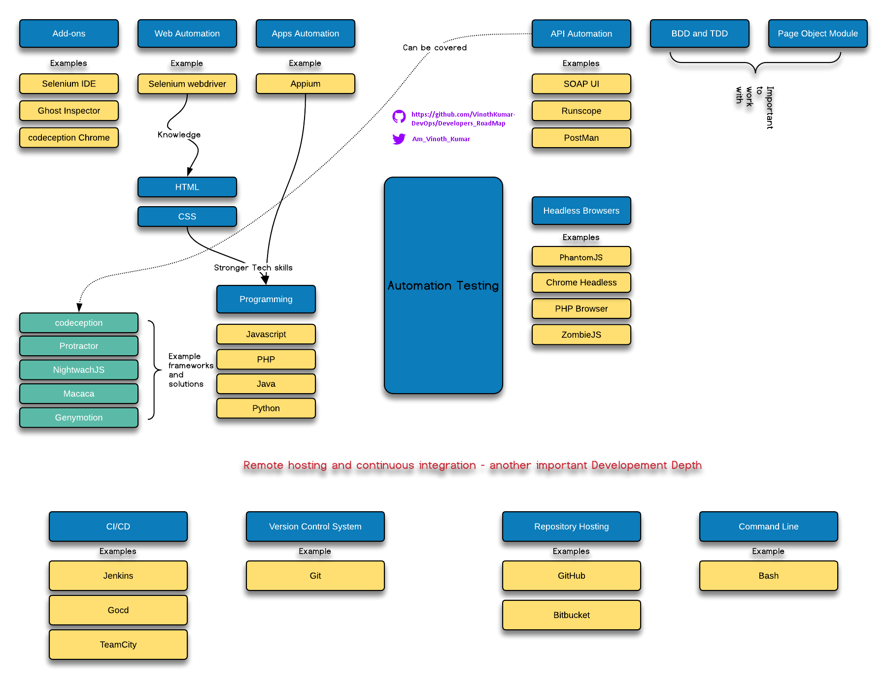

# QA_RoadMap
This article offers an overview of the Quality Assurance (QA) and Testing domain, providing insights into the key aspects and technologies essential for those aspiring to embark on a career in QA Engineering.

#Delve into the main components and introduce yourself to the fundamental aspects and technologies crucial for a successful journey in QA Engineering. While this roadmap is not exhaustive, it serves as a foundational guide, allowing flexibility to customize and explore additional types and methodologies based on individual preferences and goals.

                  

 
#Mastering Testing Fundamentals is a pivotal starting point, differentiating a good from an excellent QA Engineer. This comprehension phase is critical for achieving extensive test scenario coverage and gaining insight into system operations.

#Initiating testing and discerning when to apply specific testing types, illustrated through examples, significantly enhances the software life cycle and development process.

:crystal_ball: I encourage any QA Engineer to ensure that above is wrapped up before starting with automation, as i would say that the main key feature for automation is to `Document Manually Written Test Cases`  and `Engineering` it in a way the code will be `readable` `understandable` and `reusable`.
 
                      

 
Please, :star: it if you like it or you learned something after :clap: :clap: 
